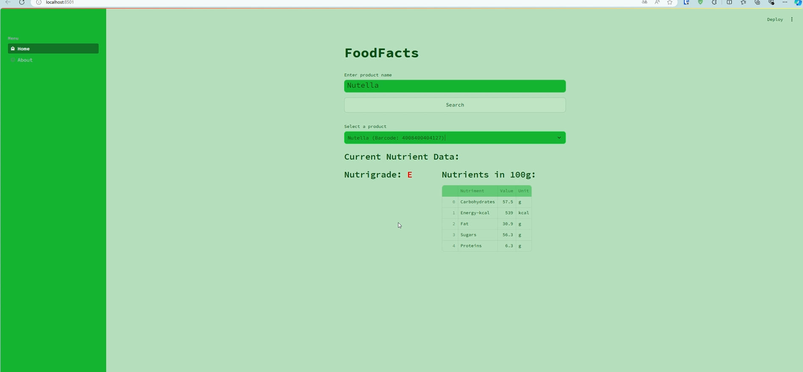

<div align="center" id="top"> 
  

  &#xa0;

  <!-- <a href="https://foodly.streamlit.app">Demo</a> -->
</div>

<h1 align="center">Foodly</h1>

<p align="center">
  

  

  
</p>


<p align="center">
  <a href="#dart-about">About</a> &#xa0; | &#xa0; 
  <a href="#sparkles-features">Features</a> &#xa0; | &#xa0;
  <a href="#rocket-technologies">Technologies</a> &#xa0; | &#xa0;
  <a href="#white_check_mark-requirements">Requirements</a> &#xa0; | &#xa0;
  <a href="#checkered_flag-starting">Starting</a> &#xa0; | &#xa0;
  <a href="#memo-license">License</a>
</p>

## Contributors

<p align="center">
  <a href="https://github.com/cipher-shad0w" target="_blank">Cipher Shadow</a> &#xa0; | &#xa0;
  <a href="https://github.com/arvedb" target="_blank">Arved Bahde</a> &#xa0; | &#xa0;
  <a href="https://github.com/mirixy" target="_blank">Miriam</a>
</p>

<br>

## :dart: About ##

Welcome to the Streamlit app that utilizes the [Open Food Facts Python SDK](https://github.com/openfoodfacts/openfoodfacts-python) to fetch and display food product data from [https://de.openfoodfacts.org/](https://de.openfoodfacts.org/). This project was created for a mini hackathon organized by Kevin Chromik.




## :sparkles: Features ##

:heavy_check_mark: User-friendly interface to search for food products.
:heavy_check_mark: Search for food products by text.
:heavy_check_mark: Fetches nutriscore and nutriments data. 
:heavy_check_mark: Displays results in a structured and easy-to-read format.

## :white_check_mark: Requirements ##

Before starting :checkered_flag:, you need to have [Git](https://git-scm.com) installed.


## Installation

1. **Clone the repository:**
   ```bash
   git clone https://github.com/cipher-shad0w/Foodly.git
   cd your-repo
   ```

2. **Install dependencies:**
   ```bash
   pip install -r requirements.txt
   ```

## Usage

1. **Run the Streamlit app:**
   ```bash
   cd frontend
   streamlit run app.py
   ```

3. **Enter the name of a food product in the text input field and submit to get a list of found products details. Click the desired product to get nutriscore and nutriments data.**

## Project Structure

- `test.py`: Main file to run the Streamlit app.
- `requirements.txt`: List of Python dependencies.

## Technologies Used

- [Streamlit](https://streamlit.io/): Framework for creating interactive web applications.
- [Open Food Facts Python SDK](https://github.com/openfoodfacts/openfoodfacts-python): Python library for interacting with the Open Food Facts database.

## License

This project is licensed under the MIT License. See the LICENSE file for more details.

## Acknowledgements

Special thanks to <a href="https://github.com/kchromik" target="_blank">Kevin Chromik</a> for organizing the mini hackathon.

---

If you have any questions or need further assistance, please feel free to contact any of the contributors.

Happy coding!


Made with :heart: by:
<a href="https://github.com/cipher-shad0w" target="_blank">Cipher Shadow</a> &#xa0; | &#xa0;
<a href="https://github.com/arvedb" target="_blank">Arved Bahde</a> &#xa0; | &#xa0;
<a href="https://github.com/mirixy" target="_blank">Miriam</a> 

&#xa0;

<a href="#top">Back to top</a>